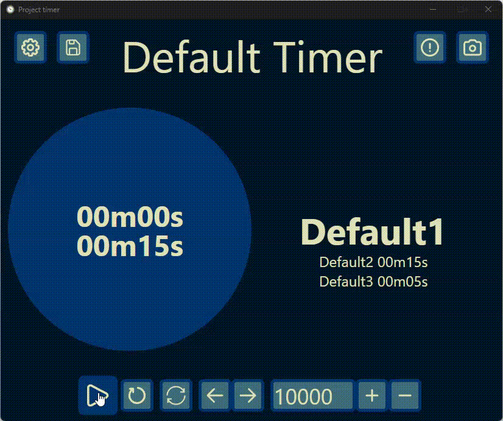

<div align="center">

# ⏱️ Timer with Stages




**An easy-to-use timer with customizable stages.**
<br/>
Supports virtual camera output, local file saving (Windows), or runs directly in the browser on any device.

[**Download Latest Release**](https://github.com/Pazzann/project-timer/releases)

</div>

---

## ✨ Key Features
- **Custom Stages:** Configure multiple stages with specific durations.
- **Full Control:** Start, pause, add time, and reset with ease.
- **Visual Feedback:** Clear progress indicators for each stage.

## ⚙️ Customization
Make it yours. You can tweak almost every aspect of the timer:
- **Stage Logic:** Set `auto-new-stage` to switch automatically, or `allow-overlap` to keep the timer running past the limit.
- **Aesthetics:** Change color schemes and fonts to match your brand or mood.
- **Display:** Toggle visibility for Days, Hours, Seconds, and Milliseconds.
- **Presets:** Save your configurations to files (Windows) or use line presets (Web & Windows).

## 🆚 Windows .exe vs. HTML
Which version is right for you?

| Feature | Windows (.exe) | HTML / Web |
| :--- | :---: | :---: |
| **Virtual Camera Support** | ✅ | ❌ |
| **Save/Load System** | ✅ | ❌ |
| **Background Rendering** | ✅ (Runs minimized) | ❌ |
| **Cross-Device Access** | ❌ | ✅ |

## 🎯 Use Cases
- **🎲 Board Games:** Strictly limit turn times.
- **🎤 Presentations:** Keep speakers on track during preparation.
- **🏆 Competitions:** Output timing to a big screen via Virtual Camera.

---

## 🚀 Install & Build Guidance

Grab the [latest release here](https://github.com/Pazzann/project-timer/releases) or build it yourself using the steps below.

### 1. HTML Build
*Prerequisite: You need `yarn` installed.*

```bash
yarn
yarn build
```

### 2. Windows Exe Build
*Prerequisite: Install [Inno Setup](https://jrsoftware.org/isdl.php) first.*

1. Run the build command:
   ```bash
   yarn electron:build
   ```
2. Open the **Inno Setup** app.
3. Load the script from the main folder.
4. Press **Compile**.
5. Find your setup file in the `Output` folder.
