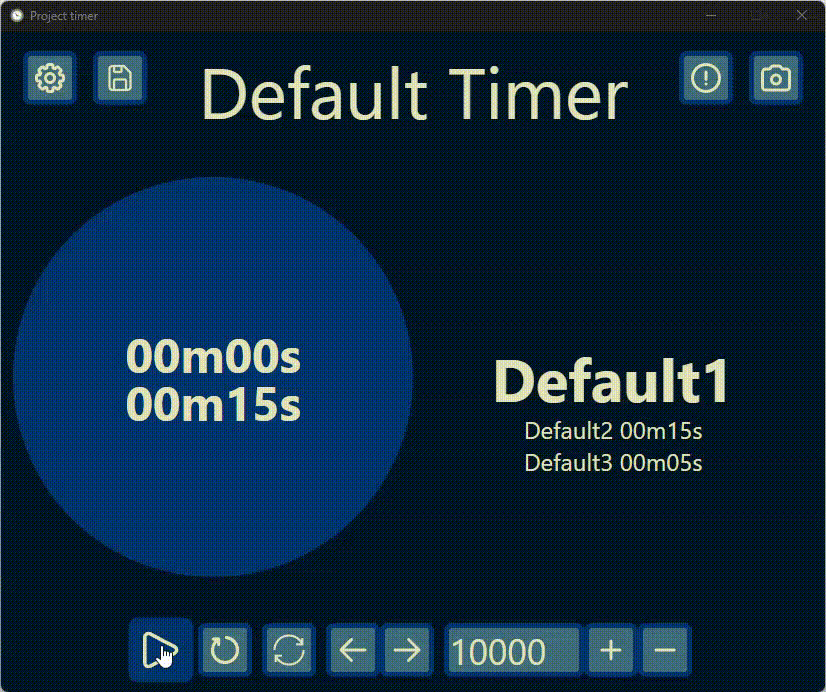

<div align="center">

# ⏱️ Project Timer




**A highly customizable multi-stage timer.**
<br/>
Runs as a Windows desktop app with virtual-camera output, or directly in your browser on any device — both with full save support.

[**⬇️ Download Latest Release**](https://github.com/Pazzann/project-timer/releases)
&nbsp;·&nbsp;
[**🌐 Try it Online**](https://pazzann.github.io/project-timer/)

</div>

---

## ✨ Key Features

- **Multi-Stage Timing** — Define any number of stages with their own durations and behaviors. Reorder them by drag and drop.
- **Six Timer Visualizations** — Radial, Ring, Linear, Number, Blocks, or Wave — each fully themed.
- **Six UI Themes** — Default, Minimal, Material, Glass, Soft UI (Neumorphism), and Retro restyle the entire app.
- **Color Themes** — A library of presets plus full per-color customization (background, primary, secondary, text).
- **Icon Packs** — Pick between Default and Material icon sets; every icon updates instantly.
- **Negative Time** — Stages can count past zero (great for timeouts and overruns), with distinct visual feedback per timer type.
- **Saves Everywhere** — Persist your configurations as files (Windows) or in browser storage (Web). The last session is auto-restored on launch.
- **Preset Migration** — Saves from older versions are automatically translated to the new format.
- **Adjustable Step** — Configure the increment used by the +/− buttons.
- **Update Notifier** — The app checks GitHub for the latest release on launch.

## 🎨 Visual Customization

Project Timer 2.0 separates *what* you see from *how* it looks. Mix and match:

| Layer | Options |
|---|---|
| **Timer type** | Radial · Ring · Linear · Number · Blocks · Wave |
| **UI style** | Default · Minimal · Material · Glass · Soft UI · Retro |
| **Color theme** | Several presets + custom colors |
| **Icon pack** | Default · Material |
| **Display fields** | Hours · Minutes · Seconds · Milliseconds (toggle each) |

## ⚙️ Stage Behavior

- **`auto-new-stage`** — Switch to the next stage automatically when time runs out.
- **`allow-overlap`** — Keep counting past the limit (with overtime feedback).
- **`canGoNegative`** — Allow a stage to count below zero. Negative time is visualized as a draining fill (Ring, Linear, Blocks, Wave) or a pulsing inverted color (Radial, Number).

## 🆚 Windows vs. Web

| Feature | Windows (.exe) | Web |
| :--- | :---: | :---: |
| **Save / Load System** | ✅ (filesystem) | ✅ (browser storage) |
| **Auto-Restore Last Session** | ✅ | ✅ |
| **Virtual Camera Output** | ✅ | ❌ |
| **Background Rendering** | ✅ (runs minimized) | ❌ |
| **Cross-Device Access** | ❌ | ✅ |
| **No Install Required** | ❌ | ✅ |

> Web saves live in the browser's local storage — they persist across reloads but stay tied to that browser/profile.

## 🎯 Use Cases

- **🎲 Board Games** — Strict turn timers with visual urgency.
- **🎤 Presentations** — Keep speakers on track during prep or live talks.
- **🏆 Competitions** — Output to a big screen via Virtual Camera.
- **🧘 Workouts & Pomodoro** — Chain warmup, work, rest, cooldown stages.

---

## 🚀 Build It Yourself

Grab the [latest release](https://github.com/Pazzann/project-timer/releases) — or build from source:

### Web build
*Requires `yarn`.*

```bash
yarn
yarn build
```

The static bundle is emitted to `dist/`.

### Windows build
*Requires [Inno Setup](https://jrsoftware.org/isdl.php).*

1. Build the Electron app:
   ```bash
   yarn electron:build
   ```
2. Open **Inno Setup** and load `Project_Timer.iss` from the project root.
3. Press **Compile** — the installer lands in the `Output/` folder.

### Development

```bash
yarn dev              # Vite dev server (browser)
yarn electron:dev     # Vite + Electron together
yarn check            # svelte-check + tsc
```

---

## 🛠️ Tech Stack

Svelte 5 · TypeScript · Vite · Electron · TailwindCSS · SortableJS

## 📄 License

See [LICENSE](./LICENSE).
